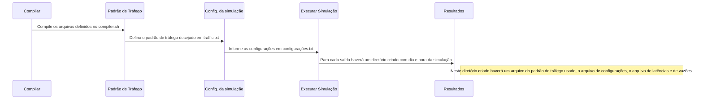

# Network on chip 42  

## Como executar o simulador?
### Instalando e configurando o Systemc
Primeiramente você precisa ter o systemc instalado em sua máquina, você pode encontrar em [accellera.org](http://www.accellera.org/downloads/standards/systemc). Siga as instruções de instalação dos fóruns do site.

Ao ter o systemc instalado, abra o arquivo .profile do linux ou o .bash_profile no mac os em modo sudo e cole  ***export SC_SIGNAL_WRITE_CHECK=DISABLE***. Ao fim destas configurações já é possível fazer suas simulações.

### Compilando a NOC
Existe um arquivo com um exemplo de como compilar tanto no mac quanto no linux. Em suma é só um exemplo pois pode variar de acordo com o modo de como você instalou o systemc. O arquivo é o ~~**compiler.sh**~~. 

## Executando uma simulação

 1.  Você pode definir o tamanho dos buffers, Arbitragem e Roteamento. No arquivo **configurações.txt**
 2. Em traffic.txt é definido o padrão de tráfego que pode ser gerado com alguns arquivos.cpp encontrados no diretório padroes de trafego/ executando um simples arquivo c++11. 
 3. Por fim é só executar o arquivo gerado ao compilar a noc. Os resultados estarão em cada pasta gerada. 

## Transaction-Level Modeling (TLM 2.0)

O modelo Network on chip 42 foi baseado na rede SOCin em uma descrição TLM.

|    Memorização    |  Controle de fluxo |  Arbitragens | Roteamentos   |
|-------------------|--------------------|--------------|---------------|
|		FIFO		|	   Handshake	 |  Round-robin	| Negative first|
|		     		|	    			 |  Rotativa	|		XY	    |
|		     		|	    			 |  Estática 	|	North Last  |
|		     		|	    			 |  Randômica	|	West First  |
|		     		|	    			 |         		|	Odd Even    |

A NoC foi limitada em um tamanho 17x17, mas pode ser aumentada facilmente.

### Projeto de Pesquisa em Redes em chip

|  Aluno                        | Adelino Afonso Fernandes Avelino  |
|-------------------------------|-----------------------------------|
|  GitHub                       |  github.com/aafavelino            |
|  Email 		 				|  aafavelino@lcc.ufrn.br           |
|  Telefone						|  (84) 98634-8534					|

|  Professor                    | Marcio Eduardo Kreutz             |
|-------------------------------|-----------------------------------|
|  Email acadêmico 				|  kreutz@dimap.ufrn.br             |
|  Departamento 				|  DIMAp - UFRN 					|

